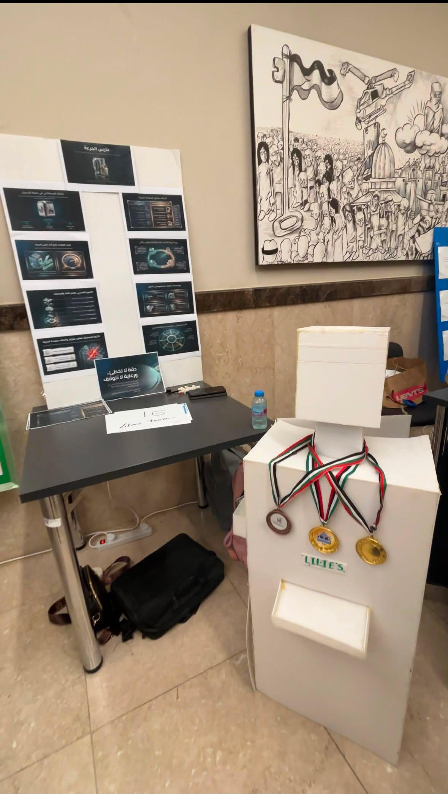

Medication Guardian 

Medication Guardian is a robotics project I built to help elderly people remember their medication times.

About the Project

I built this project using a Raspberry Pi 5, servo motors, a buzzer, and a 5-inch HDMI LCD. The medication compartments are organized using a 3D-printed rotating disk.

I designed the 3D-printed parts using Fusion 360 and programmed the system with Python.

Hardware

- Raspberry Pi 5
- 2 servo motors
- Buzzer
- 5-inch HDMI LCD
- 3D-printed rotating disk
- Medication compartments

Software

- Python
- Raspberry Pi GPIO

What I Learned

Through this project, I learned more about controlling servo motors, working with Raspberry Pi GPIO, designing parts in Fusion 360, and combining software with hardware.

Future Improvements

- Patient identification
- Face recognition
- Personalized medication schedules
- Voice interaction
